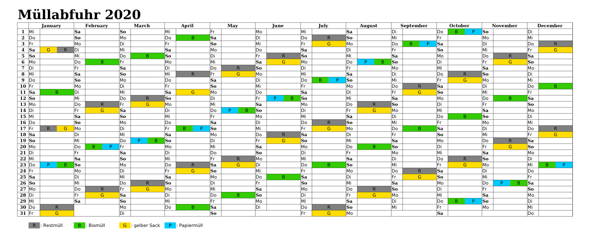

# Garbage Calendar

This Python tool requests the future garbage collection schedule from the jumomind webservice. The received data is used to output a garbage collection calendar in excel or pdf that is ready to be printed as seen below.  
Currently. only Ingolstadt is supported.




## Implementation

The project uses the [requests package](https://pypi.org/project/requests/) to read in information from the webservice.  
For writing the gathered information into the excel file, the [openpyxl package](https://pypi.org/project/openpyxl/) is required.  
The same is done for pdf using [matplotlib](https://pypi.org/project/matplotlib/).  

## Installing the package

The project uses **Python3**. According to [official documentation](https://docs.python.org/3/using/unix.html#getting-and-installing-the-latest-version-of-python)
> Python comes preinstalled on most Linux distributions, and is available as a package on all others.

For information about Python installation on other platforms, please refer to the [Documentation on Python Setup and Usage](https://docs.python.org/3/using/index.html).

To install and use the package, use the following commands:
```bash
## you will need these:
sudo apt-get install python3-pip
sudo apt-get install python3-tk
# to install the package:
git clone https://github.com/SarahLucke/garbage-calendar-ingolstadt.git
cd garbage-calendar-ingolstadt/
python3 -m pip install .

# to run the package and output the calendar into the current directory:
python3 -m GarbageCalendar

# to uninstall the package, run this command from the same directory you did the install from:
python3 -m pip uninstall GarbageCalendar
```

## License
[GNU General Public License 3](LICENSE)
